<p align="center">


</p>

# 🛰️ ARGUS Intelligence API

<p align="center">
  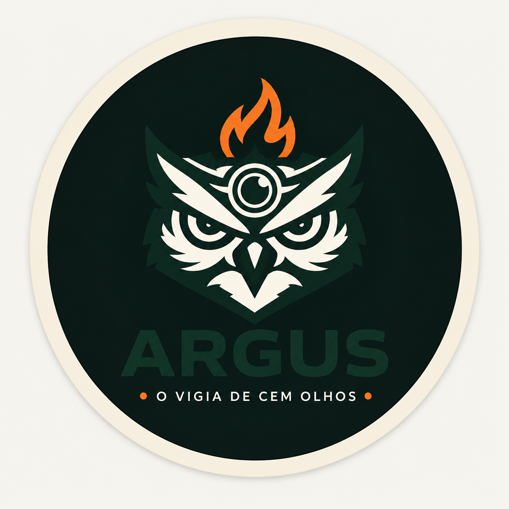
</p>

<h3 align="center">
Plataforma de Inteligência Ambiental para Monitoramento de Focos de Calor
</h3>

<p align="center">
Monitoramento • Análise de Risco • IA • Integração Distribuída • Cloud
</p>

---

## 🛰️ ARGUS Intelligence API — Central Técnica de Inteligência Ambiental

O **ARGUS Intelligence API** é uma aplicação backend desenvolvida em **Java com Spring Boot**, responsável pela camada de **inteligência ambiental, análise de risco e integração técnica** do ecossistema ARGUS.

A solução foi projetada para apoiar o monitoramento ambiental em larga escala, consolidando informações provenientes de **dados satelitais, serviços climáticos, inteligência artificial e operação em campo**, disponibilizando endpoints REST para gerenciamento de biomas, regiões monitoradas, focos de calor, alertas e classificação de risco ambiental.

A arquitetura da aplicação foi construída com foco em:

🛰️ Monitoramento ambiental baseado em dados satelitais;

🏗️ Arquitetura RESTful escalável e orientada a serviços;

🔥 Detecção, registro e acompanhamento de focos de calor;

🚨 Geração e gerenciamento de alertas operacionais;

🤖 Apoio à decisão utilizando Inteligência Artificial;

🌎 Integração com serviços externos de clima e sensoriamento;

🗄️ Persistência relacional utilizando Oracle Database;

🔐 Segurança e controle de acesso utilizando Spring Security;

⚡ Comunicação entre serviços utilizando RabbitMQ / mensageria;

☁️ Deploy em nuvem utilizando Microsoft Azure;

🔄 Integração contínua e automação de build com GitHub Actions;

📄 Documentação automatizada via Swagger / OpenAPI.


O fluxo operacional principal de monitoramento inicia pela ingestão de dados ambientais externos, passando pelo processamento e classificação de risco, geração de alertas e posterior compartilhamento das informações com os demais serviços do ecossistema ARGUS.


A **API Java atua como núcleo de inteligência da plataforma**, sendo responsável por consolidar eventos ambientais, executar regras de análise e fornecer informações estratégicas para o microserviço operacional em **C#**, responsável pelo gerenciamento de brigadas, ocorrências e resposta em campo.

A solução tem como objetivo proporcionar uma gestão ambiental mais eficiente e orientada por dados, reduzindo tempo de resposta operacional, centralizando informações críticas e ampliando a capacidade de tomada de decisão em cenários de risco ambiental.

Por meio da integração entre **monitoramento espacial, inteligência artificial, persistência de dados e arquitetura distribuída**, o ARGUS busca demonstrar como tecnologia pode apoiar operações de prevenção, acompanhamento e mitigação de impactos ambientais.

---

### 🚒 ARGUS Operations API (.NET)

Responsável pela camada operacional e resposta em campo.

Esse módulo concentra funcionalidades relacionadas à execução operacional:

* Gestão de brigadas;
* Controle de brigadistas;
* Registro de ocorrências;
* Gestão de recursos utilizados em campo;
* Registro de evidências operacionais;
* Acompanhamento da execução das ações.

As informações geradas pela API Java alimentam o fluxo operacional consumido pela API C#.

---

### 🤖 ARGUS IA

Responsável pela camada analítica do ecossistema.

Este módulo atua apoiando a tomada de decisão por meio de:

* Classificação inteligente de cenários ambientais;
* Apoio ao cálculo de risco;
* Geração de recomendações operacionais;
* Processamento complementar dos dados ambientais recebidos.

---

### 📱 ARGUS Mobile

Aplicativo responsável pela interface de acesso operacional da plataforma.

Permite:

* Consulta de alertas ambientais;
* Visualização das ocorrências registradas;
* Acompanhamento das atividades em campo;
* Consumo centralizado das APIs do ecossistema.

---
# ☁️ Infraestrutura Cloud, Deploy e Observabilidade

O ecossistema **ARGUS** foi projetado utilizando arquitetura distribuída e publicado em ambiente cloud, permitindo integração entre serviços independentes e simulação de cenários próximos ao ambiente produtivo.

A infraestrutura suporta comunicação entre aplicações **Java, .NET e componentes analíticos**, utilizando deploy automatizado, monitoramento operacional e integração contínua.

A arquitetura foi construída para consolidar conceitos de:

* Microsserviços;
* Integração distribuída;
* DevOps;
* Computação em nuvem;
* Observabilidade;
* Integração contínua;
* Escalabilidade;
* Comunicação assíncrona.

---

## ☁️ Ambiente Publicado — Microsoft Azure

A **ARGUS Intelligence API** foi publicada utilizando **Microsoft Azure App Service**, permitindo execução em ambiente Linux com **Java 17**, integração automática com repositório GitHub e disponibilização pública da aplicação.

### Configuração da infraestrutura

* ☕ Runtime Java 17;
* ☁️ Azure App Service;
* 🔄 Deploy automatizado via GitHub Actions;
* ❤️ Monitoramento operacional com Spring Actuator;
* 🐧 Ambiente Linux;
* 🌎 Publicação em ambiente cloud.

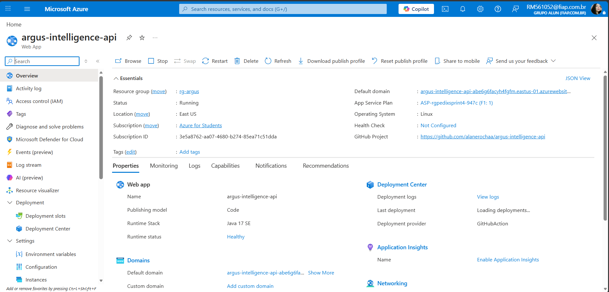

---

## 🧱 Recursos Utilizados

| Recurso | Finalidade |
|----------|-----------|
| Microsoft Azure | Hospedagem da aplicação |
| GitHub Actions | Pipeline CI/CD |
| Oracle Database | Persistência relacional |
| RabbitMQ / CloudAMQP | Comunicação assíncrona |
| Spring Boot | Backend |
| Swagger / OpenAPI | Documentação |
| Spring Actuator | Health Check |

---

## 🧩 Componentes do Ecossistema

🛰️ **ARGUS Intelligence API (Java)**  
Responsável pela inteligência ambiental, ingestão de dados e geração de alertas.

🚒 **ARGUS Operations API (.NET)**  
Responsável pela gestão operacional e resposta em campo.

🤖 **ARGUS IA**  
Responsável pela análise complementar de risco e recomendações operacionais.

📱 **ARGUS Mobile**  
Responsável pelo consumo dos serviços e experiência operacional.

Todos os componentes atuam de forma integrada por meio de APIs REST, mensageria e persistência centralizada, permitindo monitoramento ambiental e resposta operacional orientada por dados.

---

# 📊 Diagramas e Arquitetura da Solução

O ecossistema **ARGUS** foi estruturado utilizando arquitetura distribuída baseada em múltiplos serviços integrados, promovendo separação de responsabilidades entre monitoramento ambiental, processamento inteligente, operação em campo, aplicação mobile e persistência centralizada de dados.

A **ARGUS Intelligence API (Java)** atua como núcleo estratégico da plataforma, responsável pela ingestão ambiental, análise de risco e geração de inteligência operacional.

A **ARGUS Operations API (.NET)** concentra os fluxos operacionais relacionados às equipes de campo, ocorrências e resposta operacional.

Complementando o ecossistema, a **API de Inteligência Artificial** apoia o processamento analítico e o **Aplicativo Mobile** atua como interface de consumo das funcionalidades disponibilizadas pelas APIs.

A arquitetura contempla integração com serviços externos, comunicação assíncrona por mensageria, persistência relacional em Oracle Database e deploy em ambiente cloud utilizando Microsoft Azure com pipeline automatizada via GitHub Actions.

```text
                                         ┌─────────────────────────────┐
                                         │      Microsoft Azure        │
                                         │    App Service + CI/CD      │
                                         └─────────────┬───────────────┘
                                                       │

       ┌───────────────────────────────────────────────┼──────────────────────────────────────────────┐
       │                                               │                                              │

┌──────────────────────┐               ┌────────────────────────┐               ┌──────────────────────┐
│    NASA FIRMS API    │               │      Weather API       │               │      API IA          │
│ Dados Satelitais     │──────────────▶│ Dados Climáticos       │──────────────▶│ Inteligência         │
└──────────────────────┘               └────────────────────────┘               └──────────┬──────────┘
                                                                                             │
                                                                                             ▼

                           ┌──────────────────────────────────────────────┐
                           │     ARGUS Intelligence API (Java)            │
                           │----------------------------------------------│
                           │ BIOMA                                        │
                           │ REGIAO                                       │
                           │ FOCO_CALOR                                   │
                           │ ALERTA                                       │
                           │ Análise de Risco                             │
                           │ Integrações                                  │
                           │ Swagger / OpenAPI                            │
                           └──────────────────┬───────────────────────────┘
                                              │

                                   RabbitMQ / CloudAMQP

                                              │

                           ┌──────────────────▼───────────────────────────┐
                           │       ARGUS Operations API (.NET)            │
                           │----------------------------------------------│
                           │ USUARIO                                      │
                           │ BRIGADA                                      │
                           │ BRIGADISTA                                   │
                           │ OCORRENCIA                                   │
                           │ RECURSO                                      │
                           │ REGISTRO_CAMPO                               │
                           └──────────────────┬───────────────────────────┘
                                              │

                           ┌──────────────────▼───────────────────────────┐
                           │           Oracle Database                    │
                           │     Persistência Relacional Central          │
                           └──────────────────┬───────────────────────────┘
                                              │

                           ┌──────────────────▼───────────────────────────┐
                           │             ARGUS Mobile                     │
                           │         React Native / Expo                  │
                           └──────────────────────────────────────────────┘
```

---

# 🗃️ Modelo Conceitual do Banco Oracle

O diagrama abaixo representa o modelo conceitual do banco de dados Oracle utilizado pelo ecossistema ARGUS.

A modelagem contempla as entidades, relacionamentos e estruturas persistidas que sustentam a comunicação entre APIs, processamento inteligente e aplicação mobile.

A estrutura foi organizada visando:

* integridade referencial;
* separação de responsabilidades;
* integração distribuída;
* rastreabilidade operacional;
* escalabilidade arquitetural;
* persistência relacional centralizada;
* suporte à tomada de decisão baseada em dados ambientais.

## 🗃️ Modelo Entidade Relacionamento (MER)

O diagrama abaixo representa o **Modelo Entidade Relacionamento (MER)** do ecossistema **ARGUS**, demonstrando a estrutura conceitual das entidades responsáveis pelo monitoramento ambiental, processamento de risco e operação em campo.

A modelagem foi construída considerando separação de domínios entre os componentes Java e .NET, permitindo integração distribuída entre os serviços do ecossistema.

As entidades representam o fluxo completo desde a ingestão ambiental até a resposta operacional.

### Objetivos da modelagem:

* garantir integridade referencial;
* representar os relacionamentos de negócio;
* apoiar integração entre microsserviços;
* permitir rastreabilidade operacional;
* facilitar evolução arquitetural;
* sustentar persistência centralizada no Oracle Database.

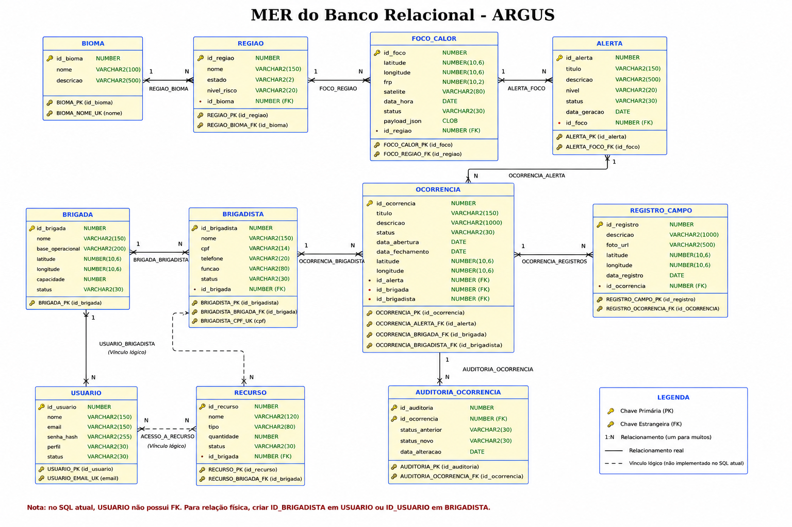

---

## 🧱 Diagrama Entidade Relacionamento (DER)

O diagrama abaixo representa o **DER físico do banco Oracle**, demonstrando tabelas, atributos, chaves primárias, chaves estrangeiras e relacionamentos persistidos na solução.

A estrutura foi organizada para suportar:

* monitoramento ambiental;
* geração de alertas;
* gestão operacional;
* integração entre APIs;
* processamento distribuído.

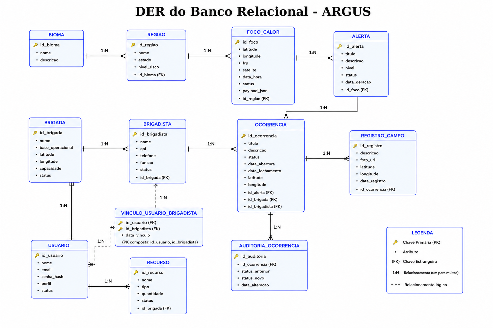

---

### 🧱 Diagrama de Classes (UML)

Representa as principais classes do ecossistema ARGUS, seus atributos, relacionamentos e responsabilidades arquiteturais.

O modelo contempla o núcleo ambiental desenvolvido em Java, integração com a camada operacional em .NET, apoio analítico via IA e componentes técnicos responsáveis pela exposição dos serviços.

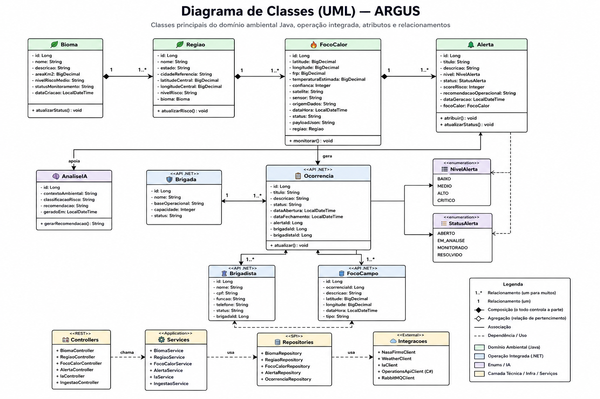
### Principais entidades representadas:

### 🌱 Núcleo Ambiental (Java)

* `BIOMA`
* `REGIAO`
* `FOCO_CALOR`
* `ALERTA`

---

### 🚒 Núcleo Operacional (.NET)

* `USUARIO`
* `BRIGADA`
* `BRIGADISTA`
* `OCORRENCIA`
* `RECURSO`
* `REGISTRO_CAMPO`

---

### 🤖 Camada Analítica

* `RISCO`
* `ANALISE_IA`
* `RECOMENDACAO_OPERACIONAL`

---

### Componentes Arquiteturais

* Controllers
* Services
* Repositories
* DTOs
* Clients
* Config
* Security
* OpenAPI


# 🔗 Implementação do HATEOAS

A **ARGUS Intelligence API** utiliza o conceito de **HATEOAS (Hypermedia as the Engine of Application State)** para enriquecer as respostas REST com links navegáveis entre recursos relacionados.

Essa abordagem permite que consumidores da API descubram dinamicamente os próximos recursos disponíveis sem depender de URIs previamente conhecidas, aumentando desacoplamento, navegabilidade e evolução da API.

Os recursos retornados podem ser encapsulados utilizando `EntityModel<>`, permitindo expor ações relacionadas ao contexto ambiental monitorado.

Exemplo de implementação:

```java
EntityModel<AlertaResponseDTO> model =
EntityModel.of(alerta,

linkTo(
methodOn(AlertaController.class)
.buscarPorId(alerta.getId())
).withSelfRel(),

linkTo(
methodOn(AlertaController.class)
.listar()
).withRel("todos_alertas"),

linkTo(
methodOn(FocoCalorController.class)
.buscarPorId(alerta.getFocoCalorId())
).withRel("foco_calor_relacionado")

);
```

Com isso, o brigadista consegue navegar entre:

* alerta atual;
* focos de calor relacionados;
* coleções completas;
* recursos dependentes.

Essa estratégia melhora a experiência de integração e aproxima a API de boas práticas REST.


---

# ⚙️ Tecnologias Utilizadas

| Categoria       | Tecnologia                      | Uso Principal              |
| --------------- | ------------------------------- | -------------------------- |
| Linguagem       | ☕ Java 17                       | Desenvolvimento backend    |
| Framework       | 🌱 Spring Boot 3.5              | Construção da API          |
| Persistência    | 🗄️ Spring Data JPA / Hibernate | ORM                        |
| Banco de Dados  | 💾 Oracle Database              | Persistência relacional    |
| Integração      | 🔌 OpenFeign / REST             | Comunicação entre serviços |
| Mensageria      | 📨 RabbitMQ / CloudAMQP         | Comunicação assíncrona     |
| Cache           | ⚡ Spring Cache                  | Otimização                 |
| Segurança       | 🔐 Spring Security + JWT        | Controle de acesso         |
| Documentação    | 📖 Swagger / OpenAPI            | Documentação automática    |
| Observabilidade | ❤️ Spring Actuator              | Monitoramento              |
| Build           | 🛠️ Maven                       | Dependências e build       |
| Deploy          | ☁️ Azure App Service            | Hospedagem                 |
| Utilitário      | ✨ Lombok                        | Redução de boilerplate     |
---

## 🧠 Stack Arquitetural

```text
Controller
↓
Service
↓
Repository
↓
Oracle Database


Service
↓
Clients
↓
NASA / IA / C# / APIs externas
```
---
## 📁 Estrutura do Projeto

```text
argus-intelligence-api
│
├── .github/                     → Pipelines e automações
├── docs/                        → Documentação complementar
│
├── src
│   └── main
│       ├── java
│       │   └── br.com.fiap.argus
│       │
│       │   ├── client/          → Integrações externas (NASA, IA, C#, Weather)
│       │   │   ├── AuthCSharpClient
│       │   │   ├── ClienteIA
│       │   │   ├── ClienteNASAFirms
│       │   │   ├── ClienteOcorrenciaCSharp
│       │   │   └── ClienteWeather
│       │
│       │   ├── config/          → Configurações da aplicação
│       │   │   ├── CacheConfig
│       │   │   ├── CorsConfig
│       │   │   ├── CSharpFeignConfig
│       │   │   ├── OpenApiConfig
│       │   │   └── SecurityConfig
│       │
│       │   ├── controller/      → Exposição dos endpoints REST
│       │   │   ├── AuthController
│       │   │   ├── BiomaController
│       │   │   ├── RegiaoController
│       │   │   ├── FocoCalorController
│       │   │   ├── AlertaController
│       │   │   ├── IAController
│       │   │   ├── SpringAiController
│       │   │   ├── IngestaoController
│       │   │   ├── IntegracaoOperationsController
│       │   │   ├── RiscoController
│       │   │   └── HomeController
│       │
│       │   ├── domain/          → Entidades JPA
│       │   │   ├── Bioma
│       │   │   ├── Regiao
│       │   │   ├── FocoCalor
│       │   │   └── Alerta
│       │
│       │   ├── dto/
│       │   │   ├── request/     → Entrada da API
│       │   │   ├── response/    → Saída padronizada
│       │   │   └── messaging/   → DTOs de mensageria
│       │
│       │   ├── exception/       → Tratamento global de erros
│       │   │   ├── BusinessException
│       │   │   ├── ResourceNotFoundException
│       │   │   └── GlobalExceptionHandler
│       │
│       │   ├── mapper/          → Conversão DTO ↔ Entidade
│       │
│       │   ├── messaging/       → Integração RabbitMQ
│       │   │   ├── MessagingConfig
│       │   │   └── ProdutorAlerta
│       │
│       │   ├── repository/      → Persistência Oracle
│       │
│       │   ├── security/        → JWT e autenticação
│       │   │   ├── JwtService
│       │   │   ├── JwtAuthenticationFilter
│       │   │   └── CSharpTokenProvider
│       │
│       │   ├── service/         → Regras de negócio
│       │   │   ├── AuthService
│       │   │   ├── BiomaService
│       │   │   ├── RegiaoService
│       │   │   ├── FocoCalorService
│       │   │   ├── AlertaService
│       │   │   ├── IAService
│       │   │   ├── SpringAiService
│       │   │   ├── IngestaoService
│       │   │   ├── OperationsCSharpService
│       │   │   └── RiscoService
│       │
│       │   └── ArgusIntelligenceApiApplication
│       │
│       └── resources
│           ├── application.properties
│           ├── db/
│           │   └── 01_create_contexto_java.sql
│           │
│           ├── static/
│           │   ├── css/
│           │   └── images/
│           │
│           └── templates/
│               └── home.html
│
├── pom.xml                      → Dependências Maven
├── README.md                    → Documentação principal
├── mvnw / mvnw.cmd              → Wrapper Maven
└── target/                      → Artefatos compilados
```

### Organização Arquitetural

A solução segue arquitetura em camadas para garantir separação de responsabilidades:

```text
Controller
↓
Service
↓
Repository
↓
Oracle Database

+ Camadas transversais:
Security
Messaging
Client
Config
Exception
DTO
```

Cada camada possui responsabilidade única, reduzindo acoplamento e facilitando manutenção, testes e evolução da aplicação.

# 🏗️ Camadas e Responsabilidades

A arquitetura da **ARGUS Intelligence API** segue o padrão de camadas bem definidas, promovendo **baixo acoplamento**, **alta coesão**, **manutenção simplificada** e **evolução independente dos componentes**.

| Camada                          | Pacote                             | Responsabilidade                                                                                             |
| ------------------------------- | ---------------------------------- | ------------------------------------------------------------------------------------------------------------ |
| **Apresentação (Controller)**   | `br.com.fiap.argus.controller`     | Define os endpoints REST responsáveis por receber requisições HTTP e expor os recursos da plataforma.        |
| **Aplicação (Service)**         | `br.com.fiap.argus.service`        | Implementa regras de negócio, processamento ambiental, classificação de risco e orquestração entre serviços. |
| **Domínio (Entities / Enums)**  | `br.com.fiap.argus.domain`         | Contém entidades JPA e enums que representam o núcleo ambiental da solução.                                  |
| **DTO / Mapper**                | `br.com.fiap.argus.dto` / `mapper` | Realiza desacoplamento entre domínio e contratos externos.                                                   |
| **Infraestrutura (Repository)** | `br.com.fiap.argus.repository`     | Responsável pela persistência utilizando Spring Data JPA e Oracle Database.                                  |
| **Configuração**                | `br.com.fiap.argus.config`         | Centraliza segurança, OpenAPI, CORS, cache e configurações técnicas.                                         |
| **Integrações Externas**        | `br.com.fiap.argus.client`         | Comunicação com NASA FIRMS, IA, Weather API e API operacional C#.                                            |

---

## Distribuição dos Componentes

### 🌐 Camada Controller

Responsável por expor recursos como:

* `/api/biomas`
* `/api/regioes`
* `/api/focos`
* `/api/alertas`
* `/api/ingestao`
* `/api/ia`

---

### ⚙️ Camada Service

Responsável por:

* processamento ambiental;
* cálculo de risco;
* ingestão de dados;
* regras de alerta;
* integração distribuída.

---

### 🗄️ Camada Repository

Responsável por:

* persistência Oracle;
* consultas;
* abstração do acesso ao banco.

---

### 🔌 Camada Client

Responsável por:

* integração NASA FIRMS;
* integração IA;
* integração C#;
* integração climática.


# 📈 Evidências Operacionais

Esta seção apresenta as validações executadas em ambiente cloud para comprovação do funcionamento dos componentes distribuídos do ecossistema ARGUS.

---

## 📸 Health Check — Aplicação e Infraestrutura

Validação do estado operacional da API Java publicada em Azure utilizando Spring Boot Actuator.

Evidências:
- Aplicação publicada e disponível;
- Conectividade com Oracle;
- RabbitMQ ativo;
- Recursos monitorados em tempo real;
- Endpoint `/actuator/health` respondendo corretamente.

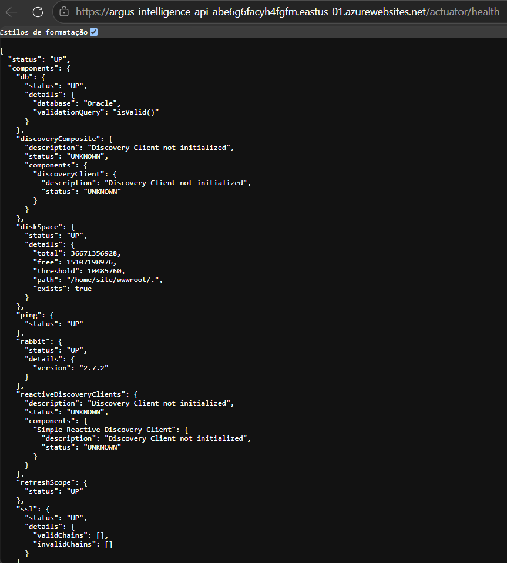

---
## 📸 Integração NASA FIRMS

Validação da disponibilidade do serviço responsável pela ingestão dos dados ambientais.

Evidências:
- Serviço externo online;
- Endpoint de ingestão operacional;
- Retorno estruturado da integração.

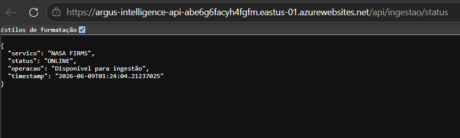

---
## 📸 Integração com IA

Validação da camada de inteligência utilizada para análise ambiental e apoio à decisão.

Evidências:
- API IA publicada;
- Endpoint de consulta operacional;
- Geração de análises e recomendações.

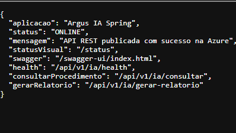

---

# 📘 Swagger / OpenAPI

# 🔐 Autenticação e Autorização

A ARGUS Intelligence API utiliza autenticação baseada em **JWT (JSON Web Token)** para proteger os endpoints privados da aplicação.

Para consumir recursos protegidos é necessário obter um token válido através do endpoint de login e utilizá-lo no botão **Authorize** do Swagger.

---

## 1. Realizar autenticação

Endpoint:

```http
POST /api/auth/login
```

Exemplo de requisição:

```json
{
  "email":"admin@argus.com",
  "senha":"Admin@123"
}
```

Após executar o login, a API retorna um token JWT.

Exemplo de resposta:

```json
{
  "token": "eyJhbGciOiJIUzI1NiJ9...[TOKEN_EXEMPLO]"
}
```

---

## 2. Autorizar no Swagger

Copie o valor retornado no campo `token`.

Clique em:

```text
Authorize 🔒
```

Preencha:

```text
Bearer SEU_TOKEN
```

Exemplo:

```text
Bearer eyJhbGciOiJIUzI1Ni...
```

Clique em **Authorize** e depois em **Close**.

---

## 3. Executar endpoints protegidos

Após autorização, os endpoints autenticados poderão ser executados diretamente pela interface Swagger.

Exemplos:

```http
GET /api/biomas
GET /api/regioes
POST /api/alertas
POST /api/ingestao/sync/24h
GET /api/riscos
```

# 📈 Evidências — Exemplos de Execução

Os exemplos abaixo representam os payloads utilizados durante validação funcional da plataforma ARGUS em ambiente cloud.

---

## 🌱 Cadastro de Bioma

### POST /api/biomas:

```json
{
  "nome": "Zona Costeira Monitorada",
  "descricao": "Área monitorada para acompanhamento de risco ambiental, alterações climáticas e geração preventiva de alertas.",
  "areaKm2": 512430.5,
  "nivelRiscoMedio": "ALTO",
  "statusMonitoramento": "ATIVO"
}
```

---

## 🔥 Cadastro de Foco de Calor

### POST /api/focos:

```json
{
  "latitude": -10.2358,
  "longitude": -54.9812,
  "frp": 92.7,
  "temperaturaEstimada": 43.2,
  "confianca": "ALTA",
  "satelite": "VIIRS",
  "sensor": "SNPP",
  "origemDado": "NASA FIRMS",
  "dataHora": "2026-06-09T10:30:00",
  "status": "MONITORADO",
  "payloadJson": "{\"source\":\"NASA\",\"criticidade\":\"ALTA\"}",
  "regiaoId": 1
}
```

---

## 🚨 Geração de Alerta Ambiental

### POST /api/alertas:

```json
{
  "titulo": "Alerta crítico de foco de calor",
  "descricao": "Foco de calor detectado com alta intensidade em área monitorada.",
  "nivel": "CRITICO",
  "status": "ABERTO",
  "scoreRisco": 95,
  "recomendacaoOperacional": "Acionar brigada e ampliar monitoramento da região.",
  "focoCalorId": 1
}
```

---

## 📋 Consulta de Alertas

### GET /api/alertas

Exemplo de retorno esperado:

```json
{
  "_embedded": {
    "alertaResponseDTOList": [
      {
        "titulo": "Alerta crítico de foco de calor",
        "nivel": "CRITICO",
        "status": "ABERTO",
        "scoreRisco": 95
      }
    ]
  }
}
```

---

## 🛰️ Ingestão de Dados Ambientais

### POST /api/ingestao/sync/24h

Exemplo de retorno esperado:

```json
{
  "status": "SUCESSO",
  "fonte": "NASA FIRMS",
  "registrosImportados": 37,
  "mensagem": "Focos de calor sincronizados com sucesso."
}
```

---

## 🤖 Integração com Inteligência Artificial

### POST /api/ia/consultar

```json
{
  "descricao": "Foco de calor detectado em área de vegetação seca.",
  "temperatura": 43.2,
  "nivelRisco": "ALTO"
}
```

Exemplo de retorno esperado:

```json
{
  "classificacao": "CRITICO",
  "recomendacao": "Realizar acompanhamento contínuo e acionamento preventivo."
}
```

---

## 🔄 Integração com API Operacional (.NET)

### GET /api/operations/ocorrencias

Exemplo de retorno esperado:

```json
{
  "ocorrencias": [
    {
      "id": 1,
      "titulo": "Incêndio em área monitorada",
      "status": "EM_ANDAMENTO",
      "brigada": "Brigada Norte"
    }
  ]
}
```
## 📨 RabbitMQ / Mensageria

Validação da comunicação assíncrona entre os componentes distribuídos do ecossistema **ARGUS**, demonstrando o desacoplamento entre a camada de inteligência ambiental (**Java**) e a camada operacional (**.NET**).

Quando um novo alerta ambiental é criado na **ARGUS Intelligence API**, o evento é publicado em uma fila RabbitMQ / CloudAMQP e posteriormente consumido pela **ARGUS Operations API**, permitindo processamento distribuído e resposta operacional em campo.

---

### Fluxo validado

```text
POST /api/alertas
        ↓
ARGUS Intelligence API (Java)
        ↓
RabbitMQ / CloudAMQP
        ↓
Fila de Alertas
        ↓
ARGUS Operations API (.NET)
        ↓
Processamento Operacional
```

---

### 📸 Publicação do Alerta

Execução do endpoint responsável pela geração do alerta ambiental.

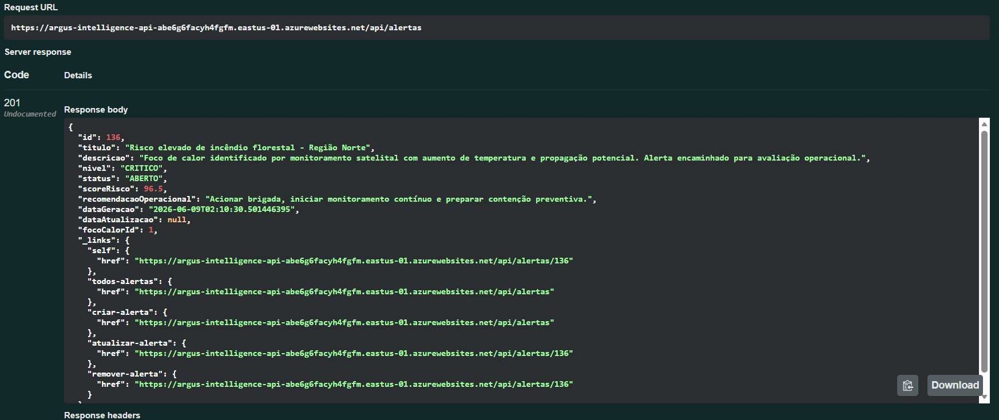

---

## 📸 RabbitMQ / Mensageria

Validação da comunicação assíncrona entre os microsserviços do ARGUS.

Evidências:
- Publicação de eventos pela API Java;
- Consumo automático pelo serviço .NET;
- Conexões AMQP ativas;
- Troca de mensagens entre produtor e consumidor.

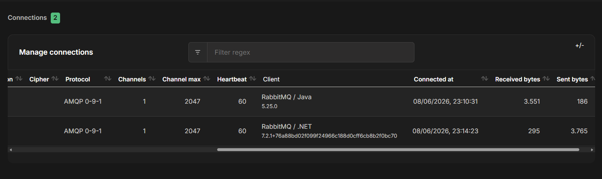

### 📸 Consumo pela API Operacional

Validação do consumo da mensagem e continuidade do fluxo operacional.
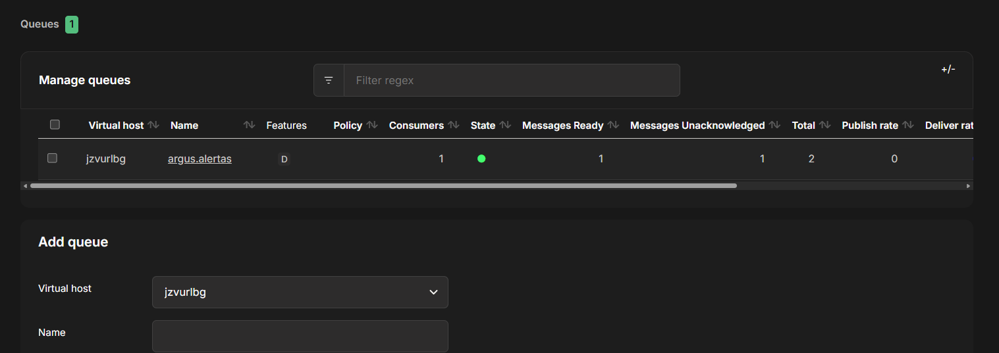

### 📸 RabbitMQ — Mensagem de alerta publicada na fila

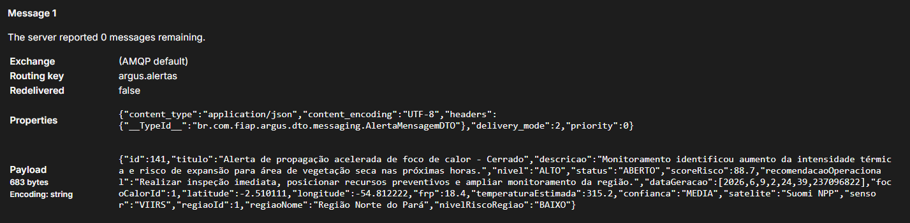

---

# ✅ Justificativa dos Requisitos da Entrega

A **ARGUS Intelligence API** atende aos requisitos da Global Solution por meio de uma arquitetura backend em **Spring Boot**, com foco em inteligência ambiental, integração distribuída, segurança, persistência relacional, mensageria e recursos de IA.

## API REST com Spring Boot

A aplicação foi desenvolvida como uma **API RESTful** utilizando Spring Boot, expondo endpoints para gerenciamento de biomas, regiões monitoradas, focos de calor, alertas ambientais, ingestão de dados externos, análise de risco e integração com outros serviços do ecossistema ARGUS.

A API não se limita a operações CRUD, pois também executa fluxos de negócio reais, como:

* ingestão de dados ambientais externos;
* geração de alertas com base em focos de calor;
* classificação de risco;
* integração com IA;
* publicação de eventos em fila;
* comunicação com a API operacional em .NET.

## Boas práticas REST e qualidade de código

O projeto foi estruturado em camadas, separando responsabilidades entre `controller`, `service`, `repository`, `dto`, `mapper`, `client`, `security`, `config` e `messaging`.

Essa organização reduz acoplamento, melhora manutenibilidade e facilita evolução futura da solução. Também foram utilizados DTOs para evitar exposição direta das entidades JPA, tratamento global de exceções e padronização dos contratos da API.

## Persistência com banco relacional

A persistência dos dados é realizada em **Oracle Database**, utilizando Spring Data JPA e Hibernate. O modelo relacional contempla entidades como `BIOMA`, `REGIAO`, `FOCO_CALOR` e `ALERTA`, garantindo integridade dos dados por meio de chaves primárias, chaves estrangeiras e relacionamentos entre as tabelas.

## Segurança com Spring Security e JWT

A API possui controle de acesso com **Spring Security** e autenticação baseada em **JWT**. O usuário realiza login no endpoint de autenticação, recebe um token e utiliza esse token para acessar endpoints protegidos.

Essa abordagem garante uma comunicação stateless, segura e adequada para APIs REST distribuídas.

## Swagger e OpenAPI

A documentação da API foi disponibilizada com **Swagger/OpenAPI**, permitindo visualizar, testar e validar os endpoints diretamente pelo navegador. Isso facilita a avaliação técnica, o consumo da API por outros serviços e a padronização dos contratos expostos.

## HATEOAS

A API utiliza HATEOAS para enriquecer as respostas REST com links navegáveis entre recursos relacionados, como alertas, focos de calor e coleções associadas.

Essa implementação aproxima a API de uma arquitetura REST mais madura, permitindo que clientes descubram recursos relacionados dinamicamente.

## Cache

Foi utilizado cache para otimizar consultas e reduzir processamento repetitivo em operações que podem ser reutilizadas durante a execução da aplicação. Essa estratégia melhora performance, reduz carga sobre o banco de dados e contribui para maior eficiência da API.

## CORS

A configuração de CORS permite que a API seja consumida por aplicações externas, como front-end web, mobile e demais serviços do ecossistema ARGUS. Isso viabiliza integração distribuída entre diferentes clientes e camadas da solução.

## Arquitetura de microsserviços

O ARGUS foi estruturado como um ecossistema distribuído, com separação de responsabilidades entre diferentes serviços:

* **ARGUS Intelligence API Java**: inteligência ambiental, ingestão, focos de calor e alertas;
* **ARGUS Operations API .NET**: brigadas, ocorrências e resposta operacional;
* **ARGUS IA**: análise inteligente e recomendações;
* **ARGUS Mobile**: consumo operacional da solução.

Essa divisão permite maior escalabilidade, independência tecnológica, manutenção isolada e evolução modular dos componentes.

## Mensageria com RabbitMQ / CloudAMQP

A mensageria foi utilizada para comunicação assíncrona entre a API Java e a API operacional em .NET.

Quando um alerta é criado na API Java, o evento é publicado em uma fila RabbitMQ/CloudAMQP. A API .NET pode consumir essa mensagem e dar continuidade ao fluxo operacional.

Esse modelo reduz acoplamento entre serviços, melhora resiliência e simula um cenário mais próximo de produção.

## Cliente HTTP com OpenFeign

A aplicação utiliza clientes HTTP, como OpenFeign, para comunicação com serviços externos e internos, incluindo integração com a API operacional em .NET e autenticação dinâmica.

O uso de Feign centraliza a comunicação entre microsserviços, reduz boilerplate, melhora organização do código e facilita manutenção das integrações.

## Spring AI / Inteligência Artificial

O projeto utiliza recursos de inteligência artificial para apoiar a análise ambiental e a tomada de decisão. A IA atua na classificação de risco, geração de recomendações operacionais e interpretação de cenários ambientais.

No contexto do ARGUS, a IA não substitui a operação humana, mas atua como apoio decisório, ajudando a priorizar alertas e orientar ações preventivas.

## Funcionalidade real da API

A API possui funcionalidade real porque representa um fluxo operacional completo:

```text
Ingestão de dados ambientais
↓
Registro de foco de calor
↓
Análise de risco
↓
Geração de alerta
↓
Publicação em fila RabbitMQ
↓
Consumo pela API operacional .NET
↓
Apoio à resposta em campo
```

Esse fluxo demonstra aplicação prática da solução, indo além de um CRUD tradicional.

## Deploy, cloud e observabilidade

A aplicação foi publicada em ambiente cloud utilizando Microsoft Azure App Service, com deploy automatizado via GitHub Actions e monitoramento por Spring Actuator.

Essa estrutura demonstra preocupação com execução em ambiente próximo ao produtivo, observabilidade, automação de entrega e disponibilidade da aplicação.

## Conclusão

A ARGUS Intelligence API atende aos requisitos técnicos da entrega ao combinar Spring Boot, Oracle Database, JWT, Swagger/OpenAPI, HATEOAS, Cache, CORS, RabbitMQ, Feign, IA e deploy em cloud.

A solução entrega valor real ao propor uma plataforma distribuída para monitoramento ambiental, análise de risco e acionamento operacional, conectando dados externos, inteligência artificial e resposta em campo.

----

# 📦 Repositórios Oficiais

☕ **API Java — ARGUS Intelligence API**
https://github.com/alanerochaa/argus-intelligence-api

⚙️ **API Operacional .NET — ARGUS Operations API**
https://github.com/annabonfim/argus-dotnet-api

🤖 **API de Inteligência Artificial — ARGUS IA**
https://github.com/DudaAraujo14/argus-ia-spring

---

# 🎬 Vídeo de Apresentação

O vídeo de apresentação demonstra o funcionamento completo do ecossistema **ARGUS**, evidenciando a arquitetura distribuída, integração entre serviços e fluxo operacional desenvolvido durante a Global Solution.

A demonstração contempla ingestão ambiental, análise de risco, geração de alertas, consumo entre APIs, persistência em banco relacional e publicação em ambiente cloud.

📺 **Assista aqui:**
`[INSERIR LINK DO VÍDEO GS]`

---

# 🧾 Conteúdos Demonstrados no Vídeo

☁️ Deploy da aplicação em Microsoft Azure App Service;

⚙️ Pipeline CI/CD utilizando GitHub Actions;

🔐 Fluxo de autenticação e autorização utilizando JWT;

🛰️ Ingestão de dados ambientais externos (NASA FIRMS);

🔥 Cadastro e gerenciamento de focos de calor;

🚨 Geração e gerenciamento de alertas ambientais;

🤖 Integração com módulo de Inteligência Artificial;

📖 Documentação técnica via Swagger/OpenAPI;

🔗 Navegação REST utilizando HATEOAS;

❤️ Monitoramento operacional via Spring Actuator;

🧱 Persistência relacional utilizando Oracle Database;

📨 Comunicação assíncrona utilizando RabbitMQ / CloudAMQP;

🔄 Integração entre API Java e API operacional em .NET;

📱 Consumo dos serviços pelo ecossistema ARGUS;

☁️ Execução distribuída em ambiente cloud.

---

# ⚡ Cache

Para melhorar desempenho e reduzir consultas repetidas ao banco de dados, a **ARGUS Intelligence API** implementa mecanismos de cache utilizando **Spring Cache**.

A solução foi configurada para armazenar temporariamente resultados de operações de leitura e invalidar automaticamente os dados armazenados sempre que houver alteração de estado na aplicação.

### 🧩 Componentes utilizados

| Recurso          | Objetivo                                 |
| ---------------- | ---------------------------------------- |
| `@EnableCaching` | Habilitar infraestrutura global de cache |
| `@Cacheable`     | Armazenar resultados de consultas        |
| `@CacheEvict`    | Invalidar dados após alterações          |

---

### 🔄 Fluxo de Funcionamento

```text
GET /api/alertas
        ↓
Consulta realizada no Oracle
        ↓
Resultado armazenado em cache
        ↓
Novas consultas reutilizam o resultado
```

Quando operações de escrita são executadas (`POST`, `PUT` ou `DELETE`), o cache é automaticamente invalidado para manter consistência entre aplicação e banco de dados.

---

### ⚙️ Estratégia Aplicada

```text
listar()
↓
@Cacheable("alertas")


buscarPorId()
↓
@Cacheable("alertaPorId")


criar()
atualizar()
remover()
↓
@CacheEvict()
```

---

### 🚀 Benefícios Obtidos

✅ Redução de consultas repetidas ao Oracle
✅ Melhor tempo de resposta da API
✅ Menor processamento em operações de leitura
✅ Estrutura preparada para crescimento e escalabilidade

---

### 📸 Evidência — Cache Aplicado

Validação da implementação utilizando **Spring Cache** na camada de serviços.

Evidências demonstradas:

* infraestrutura habilitada com `@EnableCaching`;
* consultas utilizando cache;
* invalidação automática após alterações.


---

## 🌐 CORS

A aplicação possui configuração de CORS para permitir o consumo da API por clientes externos do ecossistema ARGUS, como aplicações web, mobile e microsserviços integrados.

A configuração foi externalizada via `application.properties`, permitindo ajustar as origens autorizadas conforme o ambiente de execução.

Métodos liberados:

GET, POST, PUT, DELETE, PATCH e OPTIONS.
---

# 👩‍💻 Integrantes e Responsabilidades

| Nome Completo                  | RM       | Responsabilidade no Projeto                                                                                                  | GitHub        |
| ------------------------------ | -------- | ---------------------------------------------------------------------------------------------------------------------------- | ------------- |
| **Alane Rocha da Silva**       | RM561052 | Arquitetura e desenvolvimento da API Java, inteligência ambiental, integrações externas, banco Oracle e documentação técnica | @alanerochaa  |
| **Anna Beatriz Bonfim**        | RM559561 | Desenvolvimento da API operacional em .NET, gestão operacional e integração entre serviços                                   | @annabonfim   |
| **Maria Eduarda Araujo Penas** | RM560944 | Desenvolvimento da camada de Inteligência Artificial, análise de risco e apoio analítico                                     | @DudaAraujo14 |

---

<p align="center">
Desenvolvido com 💜 pela equipe <strong>CodeGirls</strong> — Global Solution • FIAP 2026
</p>
